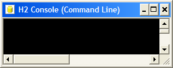
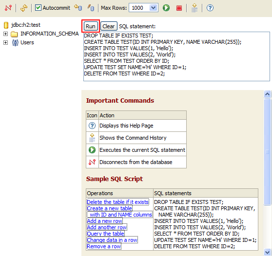
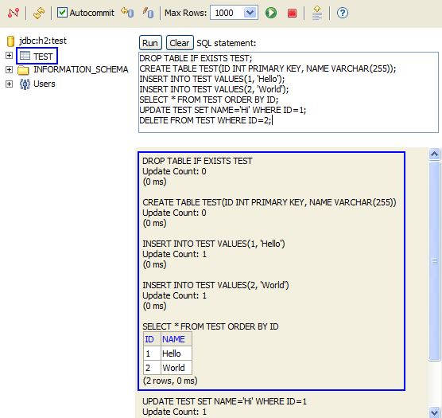

入门
====

## 内嵌 H2 在应用中

H2 可以使用内嵌模式或者是服务器模式。使用内嵌模式，需要做如下步骤：

* 添加`h2*.jar` 到 classpath (H2 没有任何依赖)
* 使用 JDBC 驱动类: `org.h2.Driver`
* 数据库的 URL 是`jdbc:h2:~/test`,在你本地目录打开数据库`test`
* 此时，新的数据库就自动创建了

## 使用 H2 控制台

控制台运行你在浏览器访问 SQL 数据库。

如果没有正常运行，参见[教程](../Tutorial/README.md))一章。

### 步骤 

#### 安装

使用 Windows Installer 安装软件

#### 启动控制台

点击 [Start], [All Programs], [H2], and [H2 Console (Command Line)]:

出现控制台窗口:

同时浏览器会弹出一个新页面<http://localhost:8082>。可能会有防火墙的安全警告。如果是在本地访问数据库，就不用处理。

#### 登陆

选择 [Generic H2] ，点击 [Connect]:

现在可以登陆了

#### 示例

点击 [Sample SQL Script]:

SQL 命令就出现在命令输入区

#### 执行

点击 [Run]

在左侧，一个的条目 TEST 就添加到了数据库图标下。操作和结果是显示如下脚本 

#### 断开连接

点击 [Disconnect]:

来关闭连接

#### 结束

关闭控制台窗口。详见[教程](../Tutorial/README.md))一章。